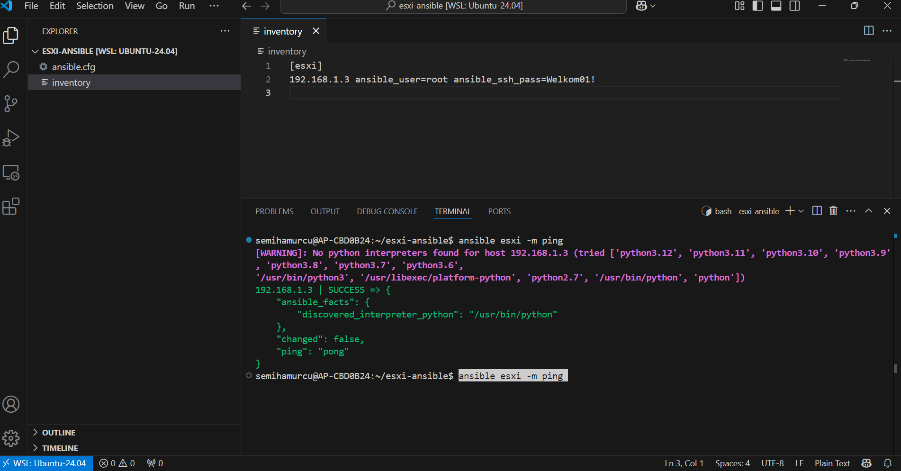

Gemaakt door Semih

# ESXi Automation met Ansible

In deze opdracht is gebruik gemaakt van **Ansible** om verbinding te maken met een ESXi-host en deze te automatiseren. De installatie en configuratie zijn uitgevoerd op een WSL (Windows Subsystem for Linux) omgeving.

🧠 **Hulpbron**: Een deel van deze opdracht is ondersteund met behulp van [ChatGPT]https://chatgpt.com/share/6836d5bc-58b8-8002-814f-97098108539c.

## 📦 Installatie van Ansible op WSL

Voer de volgende commando's uit in je WSL-terminal:

sudo apt update
sudo apt install ansible -y

### 1. Maak een nieuwe projectdirectory aan:
mkdir esxi-ansible
cd esxi-ansible

### 2. 🗂️ Inventory-bestand aanmaken
touch inventory.ini

Voeg de volgende inhoud toe:

[esxi]
192.168.1.3 ansible_user=root ansible_ssh_pass=Welkom01! ansible_connection=ssh

### 3. Ansible configuratiebestand
touch ansible.cfg

Inhoud:

[defaults]
inventory = ./inventory.ini
host_key_checking = False

### 4. Verbinding testen
ansible esxi -m ping

## Eindresultaat

